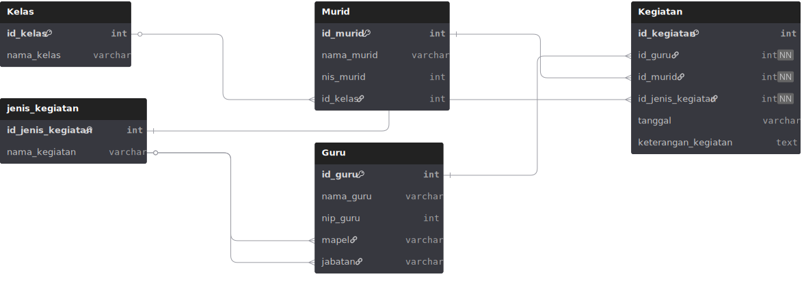

<h1 align="center">Kegiatan_Guru 💻</h1>

  <b> Kegiatan Guru adalah salah satu aplikasi berbasis website yang berguna untuk guru, serta murid. Sebagai guru aplikasi ini berguna untuk memantau kegiatan serta laporan yang ada di sekolah sedangkan murid bisa melihat kegiatan yang akan di jalankan sekolah.</b>

<h1 align="center">Fitur yang di dapatkan 💻</h1>

Jika login ke admin :
1. Melihat statistik kegiatan guru
2. Mengelola akun user (tambah/hapus guru & murid)
3. Verifikasi kegiatan yang diinput guru
4. Melihat dan mencetak laporan rekap kegiatan

Jika login ke guru :
1. Input kegiatan harian
2. Upload file bukti
3. Lihat status kegiatan: approved/pending/rejected
4. Edit/hapus kegiatan (jika belum diverifikasi)

Jika login ke murid :
1. Lihat data guru
2. Lihat informasi kegiatan (opsional)
3. Kirim feedback atau lihat pengumuman

<h1 align="center">ERD – Kegiatan Guru</h1>

Lihat diagram lengkap di:  
https://dbdiagram.io/d/Kegiatan-Guru-689368addd90d17865bd91be

atau lihat gambar diagram di bawah:

  

<h1 align="center">Flowchart – Kegiatan Guru 📈📉</h1>

  

<h1 align="center">Diagram Use Case – Kegiatan Guru 📈📉</h1>

  

<h1 align="center">Activity Diagram – Kegiatan Guru 📈📉</h1>

  

<h1 align="center">Tampilan Aplikasi – Kegiatan Guru 📈📉</h1>

| Login Page | Dashboard Admin | Dashboard Guru | Dashboard Murid |
|------------|-----------------|----------------|-----------------|
|  |  |  |  |

